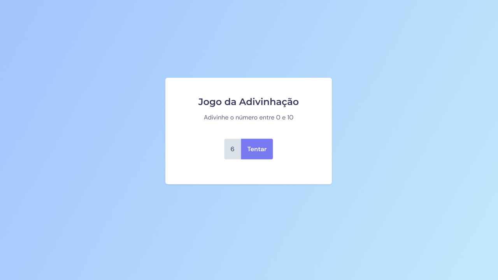

<h1 align="center">Jogo da Adivinhação</h1>

[Projeto](#projeto) &nbsp;&nbsp;&nbsp;|&nbsp;&nbsp;&nbsp; [Tecnologias](#tecnologias)
&nbsp;&nbsp;&nbsp;|&nbsp;&nbsp;&nbsp; [Layout](#layout) &nbsp;&nbsp;&nbsp;|&nbsp;&nbsp;&nbsp;
[Licença](#license)

  

 

 
 

## 💻 Projeto 

Projeto desenvolvido durante o 1° módulo do Explorer, curso da Rocketseat, no Stage 5, focado para o
aprendizado de JavaScript.

Esse projeto consiste em um jogo de adivinhação, onde dou entrada com um valor e a página só irá me
redirecionar para outra tela quando eu acertar o número gerado aleatoriamente, entre 0 e 10.

Aprendi a manipular eventos nesse projeto, assim como a DOM.

 
 

## 🚀 Tecnologias 

- HTML
- CSS
- JavaScript

 
 

## 🔖 Layout 

Você pode visualizar o layout do projeto através
[DESSE LINK](<https://www.figma.com/file/7hS79DBIZ7cJKfuH2hHR44/Jogo-Adivinha%C3%A7%C3%A3o-(Copy)?type=design&node-id=5%3A91&mode=design&t=XKMFQElUKt43nZhP-1>).
É necessário ter conta no [Figma](https://figma.com) para acessá-lo.

 
 

## 🔒 Licença

Esse projeto está sob a licença MIT.

